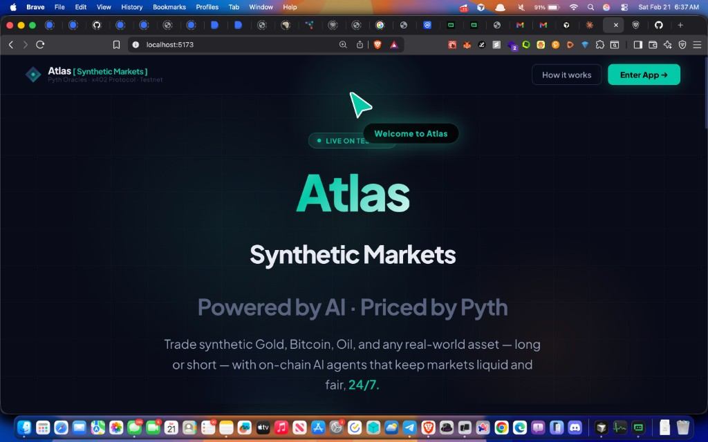
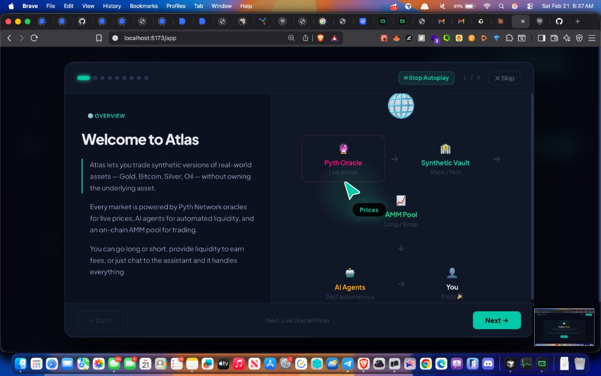
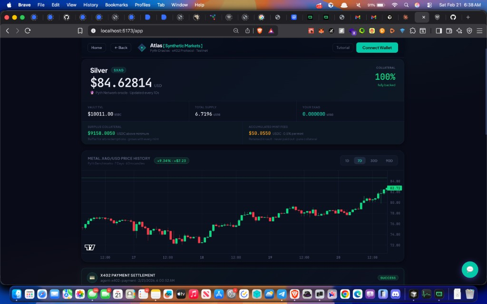

# Atlas — The Next Generation of Permissionless Commodities & RWA Trading

**Trade synthetic Gold, Silver, Bitcoin, Oil, and any real-world asset — long or short — with autonomous on-chain AI agents that keep markets liquid and fair, 24/7, no human in the loop.**

Atlas is the **permissionless synthetic markets protocol** for real-world assets (RWA). No gatekeepers. No custodians. AI agents run the show: liquidity, arbitrage, and market health — Pyth-powered prices and fully backed collateral. The way commodities and RWA trading was meant to be.

---

## Why Atlas?

- **Permissionless** — Anyone can create a market. No approval process. Deploy a new synthetic asset in one click.
- **100% collateralized** — Every synth is backed by USDC in the vault. Transparent, verifiable, and always redeemable.
- **AI-native** — Autonomous agents research oracles, pay fees, deploy contracts, and keep AMM pools liquid. Zero wallet popups; zero human steps for market creation.
- **Priced by Pyth** — Sub-second oracle prices from Pyth Network. Trade with confidence.
- **24/7 markets** — On-chain AI agents (Market Maker + Arbitrageur) provide liquidity and arbitrage around the clock. No human operators. Markets never sleep.

---

## See It in Action

### Landing — Enter the future of RWA trading


*Atlas [Truly permissionless markets] — Powered by AI · Priced by Pyth. Live on testnet.*

---

### Hero — Permissionless commodities, one sentence



*Trade synthetic Gold, Bitcoin, Oil, and any real-world asset — long or short — with autonomous on-chain AI agents that keep markets liquid and fair, 24/7, no human required.*

---

### Tutorial — Welcome to Atlas



*Atlas lets you trade synthetic versions of real-world assets without owning the underlying. Every market is powered by Pyth oracles, autonomous AI agents for 24/7 liquidity and arbitrage, and an on-chain AMM.*

---

### Market View — Silver (SXAG) — 100% backed, live prices


*Real-time price, vault TVL, surplus collateral, and accumulated fees. Full transparency.*

---

### Dashboard — Collateral, supply, and health at a glance



*100% fully backed. Surplus collateral grows with every mint. Fees retained in vault — pure collateral.*

---

### Price History — METAL.XAG/USD and beyond


*Candlestick history powered by Pyth. 1D, 7D, 30D, 90D. Trade with data.*

---

## Architecture

```
User (Web UI)
     ↓
Autonomous Agent (Backend)
     ↓
x402 Payment Layer  ←  Agent signs EIP-3009 with PRIVATE_KEY
     ↓
Atlas Smart Contracts (OracleAggregator · SyntheticToken · SyntheticVault · SynthPool)
     ↓
Pyth / Switchboard-compatible Oracle
```

| Layer | Description |
|-------|-------------|
| **Agent Wallet** | AI agent signs x402 payments and deploys contracts — fully autonomous, no MetaMask or human for market creation |
| **x402 Layer** | EIP-3009 `transferWithAuthorization` → direct on-chain settlement |
| **Backend API** | Express + SSE; job-based pipeline with real-time progress streaming |
| **Smart Contracts** | OracleAggregator, SyntheticToken, OracleReader, SyntheticVault, SynthPool on testnet |
| **Frontend** | React + Vite; agent identity, live progress, payment proof, chat-to-trade assistant |

### Deployed contracts (testnet)

Final smart contract addresses on testnet:

| Contract | Address |
|----------|---------|
| OracleAggregator | `0x789219Abc1c4F245d6DbF7E3262a07D529f524C4` |
| OracleReader | `0xDA0F3b27758ED0666fAAA775c16277DEcEf2F8dE` |
| SyntheticToken (sGOLD) | `0x7099E62F898b2482Eb24b4c5db1CdF8097903317` |
| SyntheticVault | `0x3CF009CE9F3a179b60C5b4fd9Bba581A2DAF9701` |
| SynthPool | `0xD4A99fA8e8b8B8D8321bde1ff820Bf5a904401f4` |

---

## Quick Start

### 1. Install dependencies

```bash
# Contracts
cd contracts && npm install && npm run compile && cd ..

# Backend
cd backend && npm install && cd ..

# Frontend
cd frontend && npm install && cd ..
```

### 2. Configure the backend

```bash
cp backend/.env.example backend/.env
```

Edit `backend/.env` and set:

```env
RPC_URL=https://rpc.testnet.gokite.ai
PRIVATE_KEY=<your_agent_private_key>
USDC_ADDRESS=0x0fF5393387ad2f9f691FD6Fd28e07E3969e27e63
PAYEE_ADDRESS=<address_to_receive_fees>
OPENROUTER_API_KEY=<optional_but_recommended>
```

> **Fund the agent wallet** with testnet USDT at https://faucet.gokite.ai/

### 3. Start the backend

```bash
cd backend && npm run dev
```

The agent logs its identity on startup:
```
[agent] Identity: 0xYourAgentAddress
[agent] Signature: 0x4a2b...
```

### 4. Start the frontend

```bash
cp frontend/.env.example frontend/.env
cd frontend && npm run dev
```

Open **http://localhost:5173** — you’ll see the Atlas landing page. Click **Enter App →** to go to the dashboard.

---

## Demo Flow

1. Open the frontend → agent identity and landing appear.
2. Click **Enter App** → dashboard with live markets.
3. Click **+ New Market** → fill asset name (e.g. "Gold") → **Create Market (Autonomous)**.
4. Backend runs the full pipeline; frontend streams progress:
   - ✓ AI Research (Pyth feed discovery)
   - ✓ x402 Payment (agent signs EIP-3009, settles on testnet)
   - ✓ Deploy OracleAggregator, SyntheticToken, SyntheticVault, SynthPool
   - ✓ Oracle price init
5. Payment proof and tx hashes appear; connect wallet to mint, redeem, or add liquidity.
6. Use the **chat assistant** on any market: type *"mint 10 USDC"* or *"buy 5 USDC"* and confirm — no forms required.

---

## API Endpoints

| Method | Route | Description |
|--------|-------|-------------|
| `POST` | `/create-market` | Start autonomous market creation (no wallet required) |
| `GET`  | `/job/:id` | Poll job status |
| `GET`  | `/job/:id/stream` | SSE real-time progress stream |
| `GET`  | `/agent-identity` | Agent wallet address + signature proof |
| `GET`  | `/markets` | List markets |
| `GET`  | `/markets/:id/data` | Live oracle price, TVL, supply |
| `GET`  | `/markets/:id/pool` | AMM reserves + swap quotes |
| `POST` | `/markets/:id/oracle` | Refresh oracle from Pyth / URLs |
| `GET`  | `/x402-status` | Payment token and caps |

---

## Security & Controls

| Control | Env Variable | Default |
|---------|-------------|---------|
| Per-request spend cap | `AGENT_SPEND_CAP_PER_REQUEST` | 50 USDT |
| 24h rolling spend cap | `AGENT_DAILY_SPEND_CAP` | 500 USDT |
| Rate limit (requests/window) | `RATE_LIMIT_MAX_REQUESTS` | 10 |
| Emergency kill-switch | `AGENT_REVOKED=true` | false |
| Disable payments (testing) | `X402_DISABLE=true` | false |

MockUSDC in this repo implements EIP-3009, so x402 works with `USE_MOCK_USDC=true`.

---

## Smart Contracts (Testnet)

Deployed automatically by the agent:

| Contract | Purpose |
|----------|---------|
| `OracleAggregator` | Stores asset price (Pyth / URL-driven) |
| `OracleReader` | Normalizes price to 18 decimals |
| `SyntheticToken` | ERC-20 synthetic asset |
| `SyntheticVault` | USDC collateral → mint/redeem (150% ratio) |
| `SynthPool` | Constant-product AMM for synth/USDC swaps |

---

## Deployment

### Backend — Railway

```bash
railway login
railway init
railway up --dockerfile backend/Dockerfile
railway variables set PRIVATE_KEY=... RPC_URL=... USDC_ADDRESS=... PAYEE_ADDRESS=...
```

### Frontend — Vercel

```bash
cd frontend
vercel --prod
# Set VITE_BACKEND_URL=https://your-backend.railway.app in Vercel dashboard
```

### Docker (self-hosted)

```bash
docker build -f backend/Dockerfile -t atlas-backend .
docker run -p 3000:3000 \
  -e PRIVATE_KEY=... \
  -e RPC_URL=https://rpc.testnet.gokite.ai \
  -e USDC_ADDRESS=... \
  -e PAYEE_ADDRESS=... \
  atlas-backend
```

---

## Environment Variables

See `backend/.env.example` for the full list.

Key variables:

- `PRIVATE_KEY` — agent wallet (required)
- `RPC_URL` — testnet RPC (required)
- `USDC_ADDRESS` — payment/collateral token
- `PAYEE_ADDRESS` — fee recipient
- `OPENROUTER_API_KEY` — AI research (optional)
- `X402_DISABLE=true` — skip payment for local testing

---

**Atlas — Permissionless commodities and RWA trading. Autonomous AI agents. Priced by Pyth. Live on testnet.**
